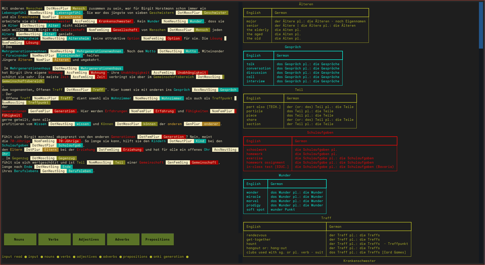

# 🚧🚧🚧🚧🚧 Textile 🚧🚧🚧🚧🚧
Textile is your ultimate companion for mastering robust German texts and building your vocabulary.
It serves as a powerful tool that not only showcases grammar cases but also aids in reinforcing language rules while immersing yourself in the text.

Textile uses the spaCy library for natural language processing,
relying on the de_core_news_sm model provided by spaCy:
- spaCy: Industrial-strength Natural Language Processing in Python.
Explosion AI. Available at: https://spacy.io/.

it is still under construction.



## How it works?
As you read through sturdy German texts,
Textile enhances your learning experience by providing real-time assistance.
It intelligently showcases grammar cases, explains word meanings, and offers insights into language rules.
The extracted vocabulary becomes the foundation for personalized Anki flashcards, enabling you to reinforce your memory and grasp German language intricacies effortlessly.

## Features
- meaning of the words.
- cases (nominative, accusative, dative or genitive).
- gender of words.
- tables of conjunction.
- generates anki flashcards for later memorization.
- builds an offline database.

## roadmap
- input a text from a txt file

## major dependencies
- pip3 install pandas
- pip3 install genanki
- pip3 install spacy
- python3 -m spacy download de_core_news_sm
- pip3 install pandarallel
- pip3 install rich
- pip3 install textual
- pip3 install bs4
- pip3 install german_nouns

## install
```sh
pip3 install -r requirements.txt
python3 -m spacy download de_core_news_sm
pip install .
```
running `pip install .` from within the source folder will expose `textile` launcher.


## code format for development
from within the src folder:
```sh
autopep8 --in-place --aggressive --aggressive --max-line-length 100 --indent-size 4 ./*.py
# or
python3 -m black .
```

## usage
```sh
python3 -m textile
```
if you have installed using the pip command. `textile` command is exposed in the shell. you can just call it.

## Roadmap
* [ ] add close button
* [ ] make text been inputed the commmand call directory
* [x] add logging system
* [ ] spread logging on all parts
* [ ] spread scroll to table on all categories
* [ ] use similar strategy as nouns to save the order of analyzis for verbs, adj ...
* [ ] let richlogs be update in realtime, workers in the background
* [ ] add an expert agent that enhances the databases while textile is on, at least for the current text words. we are talking about first result and then more enhanced results.
* [x] save the the scroll offset for each word in a dict of uinque values
* [x] make hover active for specific categories: nouns, verbs, adjective and so on
* [x] scroll to offset based on hovering action
* [ ] make analysis color based on the word gender not plural which is red (Msc -> green, Fmn->red, Neut->blue)
* [ ] add exit button that closes textile
* [ ] none is not acceptable especially for easy texts, add more nouns parsers
* [ ] change csv into a faster database like 'sqlite3'
* [ ] think on how to enhance performance overall
* [ ] enhance anki tickets format

## categories of part of speech that spacy outputs
- ADJ: adjective, e.g. big, old, green, incomprehensible, first
- ADP: adposition, e.g. in, to, during
- ADV: adverb, e.g. very, tomorrow, down, where, there
- AUX: auxiliary, e.g. is, has (done), will (do), should (do)
- CONJ: conjunction, e.g. and, or, but
- CCONJ: coordinating conjunction, e.g. and, or, but
- DET: determiner, e.g. a, an, the
- INTJ: interjection, e.g. psst, ouch, bravo, hello
- NOUN: noun, e.g. girl, cat, tree, air, beauty
- NUM: numeral, e.g. 1, 2017, one, seventy-seven, IV, MMXIV
- PART: particle, e.g. ’s, not,
- PRON: pronoun, e.g I, you, he, she, myself, themselves, somebody
- PROPN: proper noun, e.g. Mary, John, London, NATO, HBO
- PUNCT: punctuation, e.g. ., (, ), ?
- SCONJ: subordinating conjunction, e.g. if, while, that
- SYM: symbol, e.g. $, %, §, ©, +, −, ×, ÷, =, :), 😝
- VERB: verb, e.g. run, runs, running, eat, ate, eating
- X: other, e.g. sfpksdpsxmsa
- SPACE: space, e.g.
